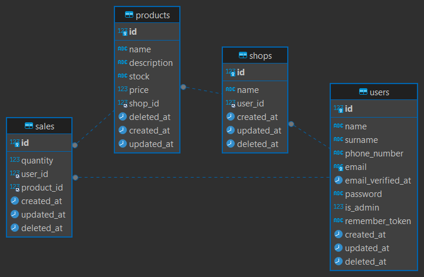

<p align="center"><a href="https://laravel.com" target="_blank"></a></p>


## Mis Comandos

```
php artisan make:model Shop -mcr 
php artisan make:model Product -mcr 
php artisan make:model Sale -mcr 

php artisan migrate:status

php artisan route:list

```
## MODELO ENTIDAD RELACIÓN


